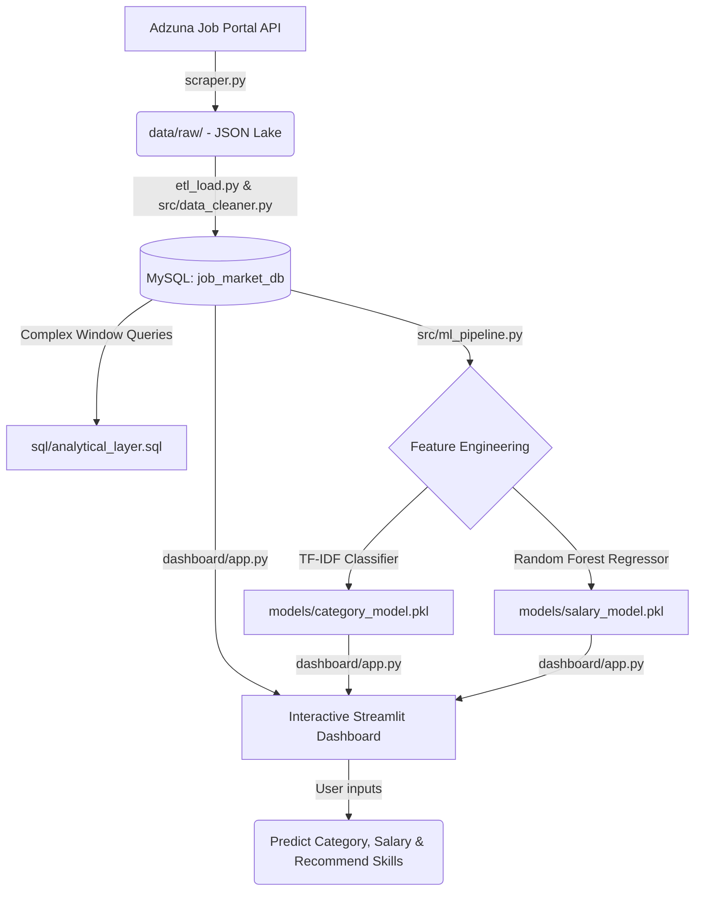

# Job Market Analytics & Career Intelligence Platform

An end-to-end Data Engineering and Data Science portfolio project that scrapes job listings, processes and cleans data into a normalized MySQL database, runs exploratory SQL queries, trains machine learning models for salary prediction & classification, and delivers a premium Streamlit interactive dashboard.

---

## 🏗️ Project Architecture



---

## 📂 Project Structure

```
job_market_analytics/
├── data/
│   ├── raw/                 # Raw JSON payloads retrieved from Adzuna API
│   └── processed/           # Filtered / clean CSV exports
├── sql/
│   ├── schema.sql           # SQL file (for database creation/schema references)
│   └── analytical_layer.sql # Advanced analytical window queries
├── notebooks/
│   └── eda_sandbox.ipynb    # Sandbox for notebook-based exploration
├── src/
│   ├── __init__.py
│   ├── db_setup.py          # Script for automatic DB creation and migrations
│   ├── scraper.py           # Refactored multi-region Adzuna API scraper
│   ├── data_cleaner.py      # Core parser (skills, experience, salary converter)
│   ├── ml_pipeline.py       # Scikit-learn classification & regression models
│   └── utils.py             # Helper and configuration utilities
├── dashboard/
│   └── app.py               # Streamlit application main script
├── models/
│   ├── category_model.pkl   # Serialized job classification pipeline
│   └── salary_model.pkl     # Serialized salary prediction pipeline
├── assets/
│   └── custom.css           # Custom CSS for premium dark-mode dashboard look
├── requirements.txt         # Project python dependencies
└── README.md                # Full portfolio-ready documentation
```

---

## 🛠️ Tech Stack

* **Data Ingestion (Scraping)**: Python `requests`, JSON serialization, secure key storage via `python-dotenv`.
* **Database (Storage)**: MySQL 8.0, SQLAlchemy Core, PyMySQL driver, DDL migrations.
* **Data Cleaning & Parsing**: Python Regular Expressions (Regex), case-insensitive token mapping.
* **Exploratory Data Analysis & Analytics**: Advanced SQL window functions (`DENSE_RANK()`, `AVG() OVER()`, `ROW_NUMBER()`), CTEs, and relational joins.
* **Machine Learning (Predictive Modeling)**: Scikit-Learn (`TfidfVectorizer`, `RandomForestClassifier`, `RandomForestRegressor`, `ColumnTransformer`).
* **Visualizations & Dashboard**: Streamlit web framework, Plotly Express, Plotly Graph Objects, HTML/CSS styling injection.

---

## 📈 Database Schema & Feature Engineering

The project uses a clean, normalized relational schema optimized for queries:
1. **`companies`**: Unique registry of hiring organizations.
2. **`locations`**: Normalized city, region, and country mapping.
3. **`skills`**: Master list of technical and soft skills.
4. **`job_postings`**: Main fact table containing titles, raw descriptions, sources, and engineered columns:
   - `experience_min` / `experience_max`: Extracted numeric years of experience using regex patterns.
   - `job_category`: Standardized roles derived from text heuristics.
   - `is_remote`: Extracted work arrangement (Remote, Hybrid, Onsite).
   - `salary_currency`: Original currency of the listing.
   - `salary_min_usd` / `salary_max_usd` / `salary_mid_usd`: Standardized exchange-rate adjusted salaries.
5. **`job_skills`**: Bridge table linking postings to master skills.

---

## 🔮 Machine Learning Models

### 1. Job Category Classifier
* **Task**: Multi-class text classification.
* **Pipeline**: Combines job title and description, runs a TF-IDF Vectorizer (`max_features=1500`, 1-2 ngrams), and fits a `RandomForestClassifier`.
* **Standardized Roles**: Data Analyst, Data Scientist, Data Engineer, Software Engineer, Business Analyst, DevOps, Management, Other.

### 2. Salary Predictor
* **Task**: Regression.
* **Pipeline**: Preprocesses categorical inputs (job category, country, work mode) using `OneHotEncoder`, numeric experience bounds via `SimpleImputer` + `StandardScaler`, and overlays binary indicators of the top 20 most frequent skills. Predicts using a `RandomForestRegressor`.

---

## 🚀 Installation & Running Guide

### Prerequisites
- Python 3.10+
- MySQL Server (running on localhost:3306)

### Step 1: Clone the Repository & Configure environment
Create a `.env` file at the root:
```env
ADZUNA_APP_ID=your_adzuna_app_id
ADZUNA_APP_KEY=your_adzuna_app_key
DB_USER=root
DB_PASSWORD=MyNewPassword123!
DB_HOST=localhost
DB_PORT=3306
DB_NAME=job_market_db
```

### Step 2: Install Dependencies
Set up your virtual environment and install requirements:
```bash
venv\Scripts\activate
pip install -r requirements.txt
```

### Step 3: Run Database Setup & Migration
Automatically create the database and tables with migrated columns:
```bash
python src/db_setup.py
```

### Step 4: Run Data Ingest (Scraper)
Scrape multi-region listings from Adzuna:
```bash
python scraper.py
```
This saves raw JSON files to `data/raw/api_jobs_<timestamp>.json`.

### Step 5: Run ETL Pipeline
Ingest and clean raw data, performing regex feature engineering and SQL table loads:
```bash
python etl_load.py data/raw/api_jobs_YYYYMMDD_HHMMSS.json
```

### Step 6: Train Machine Learning Models
Query clean data, train classification/regression models, and serialize:
```bash
python src/ml_pipeline.py
```
This saves pickles to `models/category_model.pkl` and `models/salary_model.pkl`.

### Step 7: Launch the Streamlit Dashboard
```bash
streamlit run dashboard/app.py
```

---

## 📊 SQL Analytical Queries (`sql/analytical_layer.sql`)

The repository includes a collection of production-grade SQL queries to demonstrate analytics proficiency:
- **Location-based Salary Ranks**: Ranks cities by average midpoint salary within categories using `DENSE_RANK() OVER (PARTITION BY job_category, country ORDER BY avg_salary DESC)`.
- **7-Day Rolling Averages**: Calculates rolling average daily job volumes using sliding windows (`ROWS BETWEEN 6 PRECEDING AND CURRENT ROW`).
- **Category Skills Matrix**: Aggregates and ranks the top 5 technical and soft skills requested for each career track using `ROW_NUMBER()`.
- **Work Mode Compensation Matrix**: Pivot analysis highlighting average salary spreads between Remote, Hybrid, and Onsite positions split across experience levels.

---

## 🔮 Future Enhancements
* **Airflow Orchestration**: Automate weekly scrapes and ETL loading.
* **LLM Skills Extraction**: Use OpenAI/Gemini APIs for semantic entity extraction of skills.
* **CI/CD Integration**: Establish automated testing for scraping API contracts.
* **Model Monitoring**: Track prediction drift as market salaries change.
